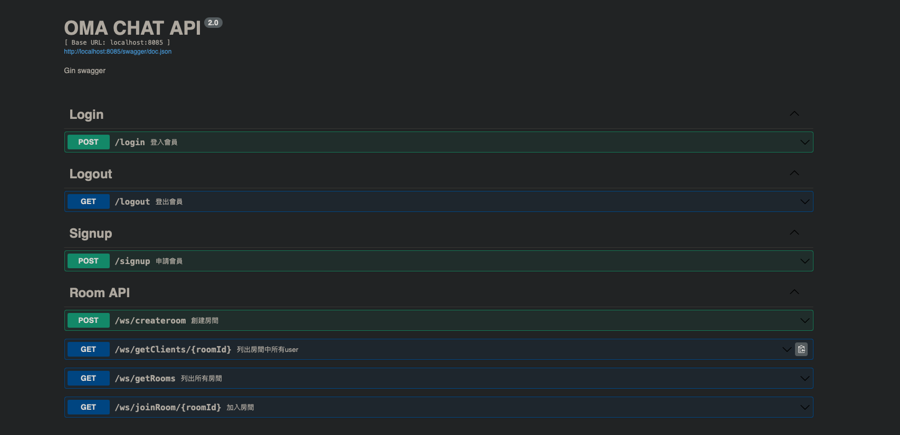

# Demo Video
[DemoVideo](https://youtu.be/ZI6p3XrCaNw)

# Technology Using:
- Docker
- Makefile

## Frontend:
Job           | Using
------------- | -------------
Framework     | React
Language      | Typescript
UI            | Tailwind
___
## Backend :
 ### Go v1.18.4
Job            |    Package
-------------  | -------------
Framework      | [gin](https://github.com/gin-gonic/gin)
Logger         | [uber-go/zap](https://github.com/uber-gozap)
API Doc        | [go-swagger](https://github.com/go-swagger/go-swagger)    
ReadConfig     | [viper](https://github.com/spf13/viper") 
Login          | [jwt](https://github.com/golang-jwt/jwt/v4)

Database       |  Package
-------------  | --------------
RDBMS          | [postgres](https://github.com/lib/pq)
NoSQL          | [go-redis](github.com/go-redis/redis/v9)    
___
# Architecture
## Clean Architecture:

## Hub:

## Swagger:

___
# Undone
redis cluster and pipeline
rdbms master and slave
